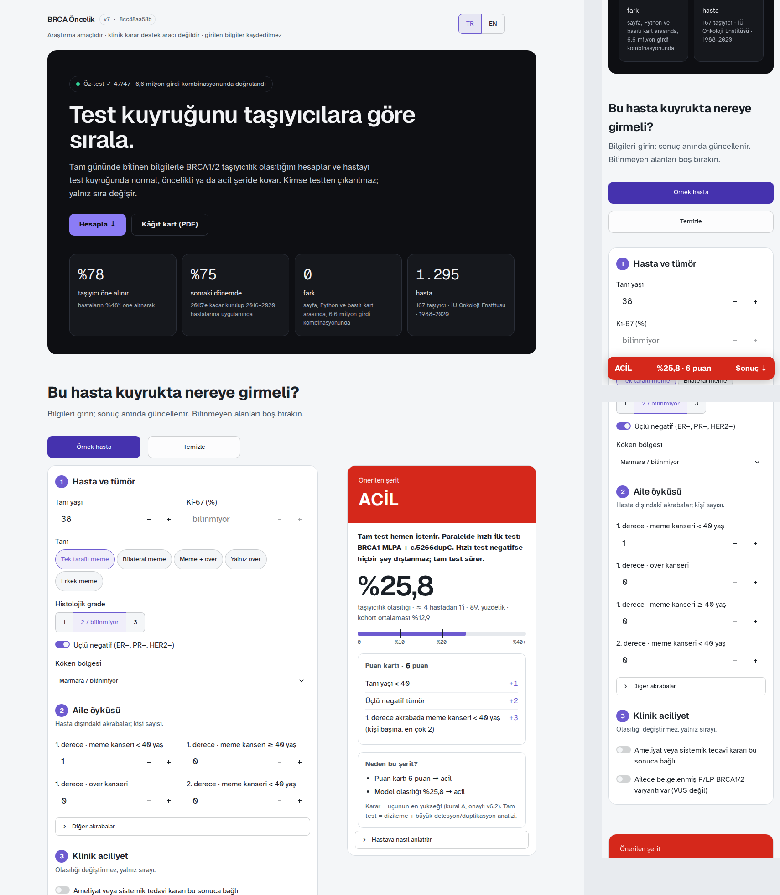

# BRCA Öncelik Hesaplayıcı · BRCA Priority Calculator

**Araştırma prototipi; klinik karar destek aracı değildir. Research prototype, not a clinical decision-support tool.**

Tanı gününde bilinen bilgilerle BRCA1/2 taşıyıcılık olasılığını hesaplar ve hastayı test kuyruğunda normal, öncelikli ya da acil şeride koyar. Varsayılan kullanımda kimse testten çıkarılmaz, yalnız sıra değişir; test azaltma ayrı bir klinik politika seçeneğidir.

Estimates BRCA1/2 carrier probability from what is known on the day of diagnosis and places the patient in the normal, priority or urgent lane of the test queue. By default nobody is removed from testing, only the order changes; test reduction is a separate clinic-policy option.



- **Kohort / cohort:** geliştirme kohortu, 1.295 hasta (167 taşıyıcı), tanı yılları 1988–2020.
- **Doğrulama / validation:** iç içe çapraz doğrulama; hastaların %48'i öne alınır, taşıyıcıların %78'i kapsanır. 2015'e kadar kurulup 2016–2020'ye uygulanınca %38 / %75.
- **Hesap denetimi / calculation audit:** yayımlanan HTML hesaplayıcı, bağımsız Python ve basılı kâğıt kart 6.635.520 girdi kombinasyonunda aynı sonucu verir. Bu uygulamanın çekirdeği (`brca_core.py`) HTML hesaplayıcıyla 200.000 profilde aynıdır. Özet: `verification.json`, `test_app_results.json`.
- **Veri / data:** depoda hasta verisi yoktur. `model_full_embedded.json` yalnız model katsayılarını ve toplu doğrulama sayılarını içerir; `selftest_vectors_synthetic.json` sentetik referans hastalardır. Uygulama girilen bilgileri kaydetmez.

```
pip install -r requirements.txt
streamlit run app.py
```

Uygulama şifre ister: Streamlit Cloud → App settings → Secrets içine `APP_PASSWORD = "..."` yazın (yerelde `BRCA_APP_PASSWORD` ortam değişkeni ya da `BRCA_NO_PASSWORD=1`). Şifre kodda veya depoda tutulmaz.

Varsayılan karar kuralı A'dır (onaylı v6.2). `?kural=B` adresi, karar bekleyen öneri B'yi önizler.

**Test azaltma modu (v6.3) · test-reduction mode:** Kullanım → Test azaltma (ya da `?mod=azalt`). Seçilen olasılık çizgisinin altında, şeridi NORMAL ve dışlama ölçütü olmayan hasta için "test atlanabilir" der ve bedelini (kaç taşıyıcının kaçtığı) gösterir; over kanseri, erkek meme, üçlü negatif, ailede over kanseri ve aciliyet her zaman test edilir. Bedel `rule_out_policy.json` dosyasındadır (iç içe çapraz doğrulama + zamansal test, yalnız toplu sayılar). / Use → Test reduction (or `?mod=azalt`): below the chosen probability line, in the NORMAL lane and with no exclusion, the app says "test can be skipped" and shows the measured price; ovarian cancer, male breast, triple-negative, ovarian family history and urgency are always tested.

Prof. Dr. Hülya Yazıcı · Dr. Öğr. Üyesi Arif Solmaz · İstanbul Sağlık ve Teknoloji Üniversitesi (İSTÜN)
